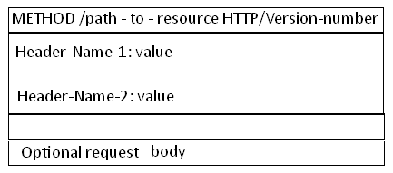

# HTTP协议介绍
[HTTP学习--MDN](https://developer.mozilla.org/zh-CN/docs/Web/HTTP/Overview)
* HTTP: 超文本传输协议（HyperText Transfer Protocol）它是客户端和web服务器数据传输的基础，现在基本上所有的web项目都遵从HTTP协议。设计HTTP最初的目的是为了提供一种发布和接收HTML页面的方法。通过HTTP或者HTTPS协议请求服务器资源
* **HTTPS**:超文本传输安全协议（**Hypertext Transfer Protocol Secure**）

HTTP协议工作于客户端-服务端架构上。浏览器作为HTTP客户端通过URL向HTTP服务端即WEB服务器发送所有请求。Web服务器有：Apache服务器，IIS服务器（Internet Information Services）等。Web服务器根据接收到的请求后，向客户端发送响应信息。

当我们打开浏览器，在地址栏中输入URL地址如：
`http://baidu.com`，然后我们就看到了网页。 原理是怎样的呢？实际上我们输入URL后，浏览器会向Web服务器发送了一个Request, Web服务器接到Request后进行处理，然后服务器Response回来给浏览器，浏览器解析Response中的HTML,这样我们就看到了网页，过程如下图所示：


# URL
URL: URL(Uniform Resource Locator) 统一资源定位符。作用:就是用于找到一个网络上的资源
如：
* `http://xxx.com/src/1.html`找到了服务器1.html资源文件    
* `http://xxx.com/images/1.png`找到了服务器1.png资源文件
**URI**:统一资源标识符（Uniform Resource Identifier）
 >注意：url只是标识资源，但不知道在哪找。开发中一般只说URL.

# URL基本构成
URL(Uniform Resource Locator) 地址用于定位一个网络上的资源,  基本格式如下
```
schema://host[:port]/path/[?query-string][#anchor]      
```
* scheme 指定低层使用的协议(例如：http, https, ftp)
 * host            HTTP服务器的IP地址或者域名port            HTTP服务器的默认端口是80，这种情况下端口号可以省略。如果使用了别的端口，必须指明，例如 http://www.baidu.com:8080/path            访问资源的路径query-string     发送给http服务器的数据查询字符串  
 * anchor           锚点
 URL的一个例子
 http://www.baidu.com/a/b/index.phpname=dachui&amp;age=33#header
 
 Schema:        http
 host:           www.baidu.com
 path:           /a/b/index.php
 Query String:    name=dachui&amp;age=33
 Anchor:         header
 # HTTP最大特点：无状态。
 http协议是无状态的，同一个客户端的这次请求和上次请求是没有对应关系，对http服务器来说，它并不知道这两个请求来自同一个客户端。 为了解决这个问题， Web程序引入了Cookie机制来维护状态。
 # HTTP消息的结构
 一个完整的http请求应该包含`请求(Request)`和`响应(Response)`部分。
 ## 请求（Request）
 先看Request消息的结构,   Request 消息分为4部分，
 * 第一部分：Request line(请求行)
 * 第二部分：Request header(请求头部)
 * 第三部分：空行
 * 第四部分：Request body(请求数据)结构如下图：
 
 
第一行中的Method：表示请求方法,比如&quot;POST&quot;,&quot;GET&quot;, Path-to-resoure表示请求的资源， Http/version-number 表示HTTP协议的版本号。

第二行：[http请求头部](https://developer.mozilla.org/zh-CN/docs/Web/HTTP/Headers)

第三行：空行

第四行：请求数据（针对于post请求）

1、如下get请求结构：
```
get /a/b/index.php HTTP/1.1
Host: www.xxx.com
User-Agent: Mozilla/5.0
```
2、post请求结构
```
post /a/b/index.php HTTP/1.1
Host: www.xxx.com
User-Agent: Mozilla/5.0 

name=dachui&amp;age=18
```
## 响应（Response）
HTTP响应也由四个部分组成，分别是：状态行、消息报头、空行和响应正文。

* * *


其中状态行由`协议/版本号 状态码 状态文本`三部分构成

## 状态码
 
[状态码](https://developer.mozilla.org/en-US/docs/Web/HTTP/Status)代表着http请求是否成功，还是失败等信息。

状态码由三位数组构成：

* 1xx: 信息，服务器收到请求，继续处理

* 2xx: 成功。 作被成功接收并处理

* 3xx: 重定向，需要进一步操作才能完成请求
 
* 4xx: 客户端错误，请求包含语法错误或无法完成请求

* 5xx: 服务端内部错误。

 下面是常见的HTTP状态码（HTTP Status Code）：
 
 * 200：请求成功301：网页（元等）被永久转移到其它URL

 * 304：未被修改，说明此资源被浏览器缓存了
 * 404：找不到此网页（资源）
 * 500：内部服务器错误其
 * [他状态码解释](https://www.runoob.com/http/http-status-codes.html)

 ## get和post区别
 
 * get参数通过url传递，post放在请求体（request body）中
 * get请求在url传递的参数有长度限制，而post没有
 * get比post更不安全，因为参数直接显示在url地址中，所以不能传递敏感数据
 * get请求浏览器会主动缓存，而post不会
 * get请求参数会保存在浏览历史记录，而post请求不会
相同点：

 * get和post本质上都是tcp连接。
 # COOKIE
 ## cookie基本概念
 Cookie是一种会话跟踪技术，其是保存在浏览器本地中的一小块数据，每个Cookie的大小一般在4KB左右，因浏览器而异。
 
 * 会话：用户进入网站，开始浏览信息到关闭浏览器的过程，就称之为是一次会话。
 * 会话跟踪技术：浏览器（客户端）和服务器之间在进行多次请求间共享数据的过程，就称为会话跟踪技术。
 
 Cookie 主要用来分辨两个请求是否来自同一个浏览器，它会在浏览器下次向同一服务器再次发起请求时被携带并发送到服务器上，从而辨别是否是来自同一浏览器。 因为`*http是无状态*`的。
 
 主要应用场景：
 * 会话状态管理（如用户登录状态、购物车等）
 个性化设置（保存用户设置的背景色等）
 浏览器行为跟踪（如跟踪分析用户行为等）
 查看当前域名下面的所有cookie
 ```javascript
 document.cookie
 ```
 查看浏览器是否打开 Cookie 功能
```javascript
 window.navigator.cookieEnabled //true
 ```
 ## cookie操作
 
 可以通过js或服务端语言（如PHP、java）来操作。
 
###  js操作cookie设置

 * 设置cookie:
 
```javascript
 document.cookie="username=tom"document.cookie="id=100"
```
* 存数组或对象需要进行转换
```
JSON.stringify() : 将对象转化为字符串类型
JSON.parse() : 将字符串转化为对象类型
```
* 设置cookie有效期
``` javascript
var d = new Date();
d.setDate( d.getDate() + 2 ); //有效期两天
document.cookie="username=tom;expires="+d
```
* 获取cookie
``` javascript
document.cookie
```
* 删除cookie
``` javascript
document.cookie="username=''"//设置为空
```
或者
``` javascript
document.cookie="username='';expire=-1"//设置时间为负数
```
### 封装cookie

* 设置cookie
``` javascript
function setCookie(k,v,d){
    if(d){
         var d = new Date();
         d.setDate( d.getDate() + d );
         document.cookie=k+'='+v + ";expires="+d;
    }else{
         document.cookie=k+'='+v;
    }
}
```
 * 获取cookie
 ```javascript
 function getCookie(k){
    if(document.cookie){
        var cookie = document.cookie;
        var arr = cookie.split('; ');
        for(var i = 0; i < arr.length; i++){
            var items = arr[i].split('=');
            if(items[0]==k){
            return items[1]
            }
        }
    }
    return "";
}
 ```
 * 删除cookie
 ```javascript
 function removeCookie(k){
    setCookie(k," ",-1);
}
 ```
 ## cookie实现注册登录核心点：
 1、注册页面存储cookie成功跳转到登录页面
 2、登录页面点击登录按钮去cookie中进行用户名和密码匹配
 
 ## php操作cookie(了解)
 
 通过setcookie函数进行操作：
 ```php
 setcookie ( string $name [, string $value = ";"; [, int $expires = 0 [, string $path = ""[, string $domain = "" [, bool$secure = FALSE [, bool $httponly = FALSE ]]]]]] )
 ```
 [php设置cookie](https://www.php.net/manual/en/function.setcookie.php)
 
##  cookie注意问题
 
 * 当设置cookie后，向服务器发起的每一次新请求，浏览器都会将之前保存的Cookie信息通过Cookie请求头部再发送给服务器，其目的为了识别是同一个客户端。
 
 * Path。 cookie访问路径。 如果cookie设置的所在路径为`"/"`、则cookie在整个域中都可用。 如果cookie设置的所在路径为`/foo/`则cookie仅在/foo目录及其所有子目录可用，如/foo/bar/目录可访问。 不设置路径默认是当前目录。**即cookie是不能跨目录访问**。
 
 * httpOnly。设置为则只能通过HTTP协议访问cookie,意味着无法通过JS来访问cookie,这可有效减少XSS的攻击。
     [XSS攻击--百度搜索](https://baike.baidu.com/item/XSS%E6%94%BB%E5%87%BB/954065?fr=aladdin)
 
 * Cookie中最好不要放敏感数据，因为用户可以篡改。
