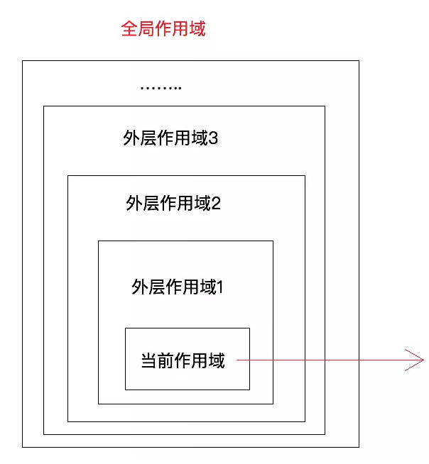
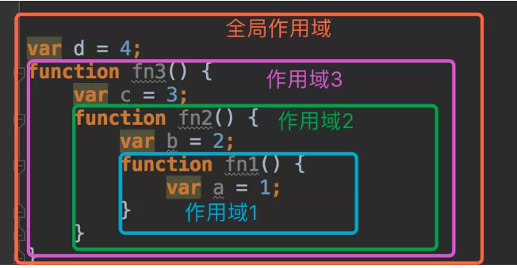

# 前言
>深入理解JavaScript的词法作用域、变量提升及函数作用域链是非常有必要的！因为它一直都伴随在我们的工作当中，且学习它们对我们后续吸收理解其他知识如：闭包等会有很大的帮助，笔者文笔有限，如果有说的不对的地方欢迎批评指正

# 浏览器中的js解析器

## 浏览器有一套自己的解析js代码的方式

> **1.预解析阶段 : 在没有解读代码之前:会把`var` 、`function`提升到当前作用域的前面(函数里面的var声明也会提前到当前函数的上面)。这里变量提升只提升声明,不提升赋值;函数提升只提升声明，不提升调用。**

> `注:预解析阶段其实就是变量提升及函数提升的阶段`

代码解释如下:
```js
//没有用var声明的情况--报错（没有变量提升）

console.log(a);//Uncaught ReferenceError: a is not defined
a = 100;
```
```js
//用var声明的情况--变量提升
console.log(a);//输出:undefined
a = 100;
```
```js
//函数提升
console.log(a);//输出:function a(){alert(2);}
function a(){
    alert(2);
}
```
> **2.运行阶段 : 代码从上到下，从左到右依次执行**

`注:在第一步中如果变量声明和函数重名，浏览器优先保留函数`

代码解释如下:
```js
//函数与变量重名,优先保留函数
    console.log(a);//输出function a(){alert(3)}；
    var a=1; //声明提前之后这里保存的是变量的赋值
    console.log(a);//输出1
     function a(){
        alert(2);
    }
```
# `函数直接声明和函数表达式声明的区别`
## 直接声明
```js
//JavaScript解析器首先会把当前作用域的函数声明提前到整个作用域的最前面

console.log(f(5,6));//函数能执行，输出:11
function f(a,b){
    return a + b;
}

```
## 函数表达式声明
```js
console.log(myFun);//变量提升输出:undefined
console.log(myFun(5,6));//函数未提升--报错:Uncaught TypeError: myFun is not a function
var myFun = function(a,b){
    return a + b;
}
```

# 那什么是作用域呢?
### 一言以蔽之，`“作用域就是一套规则，用于确定在何处以及如何查找变量（标识符）的规则”。`在这句话中读到一个关键点 `查找变量`（标识符），那么就从查找变量说起吧。

* **先看下面一段及其简单的代码:**
```js
function foo() {
	var a = 'iceman';
	console.log(a); // 输出"iceman"
}
foo(); //函数自执行

```
**☝**在foo函数执行的时候，输出一个a变量，那么这个a变量是哪里来的呢?有看到函数第一行有定义a变量的代码`var a = 'iceman'`吧。

* **再看一段同样简单的代码:**

```js
var b = 'programmer';
function foo() {
	console.log(b); // 输出"programmer"
}
foo();
```
**☝**同样的道理，在输出b的时候，自己函数内部没有找到变量b，那么就在外层的全局中查找，找到了就停止查找并输出了。

> #### 小结:以上两段代码都有查找变量，第一段代码是在函数(函数作用域)中找到a变量，第二段代码是在全局(全局作用域中找到b变量。`函数作用域`、`全局作用域`，把这两个词换入到原来那句话中，第一段代码是在函数作用域中找到a变量，第二段代码是在全局作用域中找到b变量。通俗的讲，` 作用域就是查找变量的地方`。

## 变量的作用域
* 块级作用域
```
在其它语言中，任何一对花括号中的语句都属于一个块，在这之中定义的所有变量在代码块外都是不可见的
在es6中有了let 和 const 之后JavaScript也有了块级作用域，后面再补充
```
* 全局变量
```
定义在script或者不属于某个函数的变量
```
* 局部变量
```
定义在函数内部的变量
```
# 函数的作用域链
>函数内部可以访问到该函数所属的外部作用域的变量(作用域链)
>大白话:函数的作用域变量访问原则 先在自己的局部作用域下找，如果找不到，跳到父级作用域找，如果还找不到，再往上找，最后找到全局，如果在全局还找不到则报错===作用域链

### 图解如下:



### 代码图解如下:


>性能相关--变量退出作用域之后会销毁，全局变量关闭网页或浏览器才会销毁

> 补充:在函数中如果未使用var声明变量，则该变量会成为隐式全局变量(全局变量)--`不推荐使用`--易造成命名空间的污染。代码如下:
```js
//变量被改变
var a =10;
function fn(){
    a =100;
}
fn();//函数自执行
console.log(a);//输出:100;
```
